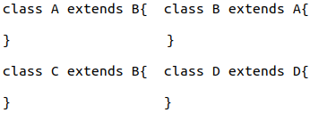
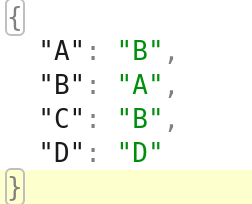
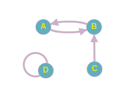

>### Note
>- The bold font indicates that the text is a Java class.
>- The highlighted text is a link to the corresponding Java class (links work only in gitlab, not in pdf).
>- The text in gray represents a Java method.


# Summary

This document contains the documentation for the portfolio work on the object-oriented constructs of the NotQuiteJava language.
The solution of exercise sheet 4 was used as template for the analysis and translation phases.
The following documentation will describe how the algorithm has been implemented and why specific design patterns have been used and which representations have been chosen for types and classes in LLVM.
In addition, the documentation will explain how issues like cyclic inheritance and overriding have been solved using examples.
At the end of each phase a description of the five additional tests is provided along with links to those test files.
Please keep in mind that the implementation is based on the template of ex04, so several parts of the code will be not covered by the documentation.

# Name and Type Analysis

## Representing Types
```
Type =          
   | INT
   | BOOL
   | NULL
   | ANY
   | INVALID
   | ArrayType
   | ClassType // represents class type in NQJ

ArrayType = // an array type has an element type (of type)
  {elementType}
```
In this section we will mainly focus on [ClassType](./src/main/java/analysis/ClassType.java), because the other types have already been explained in the functional part.
As seen above, **ClassType** is an extension of the abstract class [Type](./src/main/java/analysis/Type.java), and takes as parameters the [Analysis](./src/main/java/analysis/Analysis.java) and [NQJClassDecl](./src-generated/notquitejava/ast/NQJClassDecl.java), which will be later used to get the superclass, fields and methods.
To each valid class of NQJ (i.e. not involving in cyclic inheritance) is assigned an object of type **ClassType** containing two **HashMap** attributes fields and methods, which include all the fields and methods of the class and of its superclasses. 
The classes of **Type** can be compared to each other with the method `isSubtypeOf()`, which in case of **ClassType** does not just check if the objects are similar, but also if the object on which the method is called is not a subclass of the object passed in argument (Transitivity).
A method `load()`, on **ClassType** is used to load all fields and methods in **HashMap** by iterating from the current NQJ class to its superclasses and checking if multiple fields or methods are not declared with the same name in the same class and if the methods of the same name coming from different classes, have compatible signatures to be overridden. If the names of methods or fields are not unique in each class, the corresponding errors are added to the error list.

```java
public class ClassType extends Type {
    private String name;
    private Analysis analysis;
    private String extendedName;
    private NQJClassDecl classDecl;
    private Map<String, NQJVarDecl> fields = new HashMap<String, NQJVarDecl>();
    private Map<String, NQJFunctionDecl> methods = new HashMap<String, NQJFunctionDecl>();
        
    ...
}
```

## Cyclic inheritance

Before visiting the AST,  the **ClassType** objects are created for each valid NQJ class, while the type **ANY** is used for those that are invalid, in order to prevent the expression using an invalid class is type checked.
To check if a NQJ class is valid, a directed graph representing the "extends" relations (**<**) is built with **HashMap** and used to check if a node (here a class name) is involved in a cycle.
The graph is built by going through the NQJ classes and adding for each class (e.g. A) with an extended class (e.g. B) an entry A:B (key:value) in the **HashMap**, so that every single relation **A < B** is now represented by A:B in the graph dictionary. Example of NQJ code transforms to graph.






The method `isInvolvedInCycle()` on [NameTable](./src/main/java/analysis/NameTable.java) is walks through the graph using a while-loop and checks if a node is in a circle.
If this is the case, the class represented by the node is considered to be incorrectly declared will have the type "ANY" and its body will not be visited. For the valid NQJ class the field types will be first converted to **Type** and saved in [NQJType](./src-generated/notquitejava/ast/NQJType.java) for later use during the translation phase, then the corresponding **ClassType** will be added to the cloned [TypeContext](./src/main/java/analysis/TypeContext.java) and its methods will be also visited. After visiting the class, the block context is exited to ensure that the variable **this** is only available inside the class.

## Type checking

In regard to type checking, it is carried out on a case-by-case basis as follows (remember that the uniqueness of field names and method names is already checked in `load()` of **ClassType**):

- Before checking **MemberDecl**, the context is cloned to restrict the scope of the variables in the class body, which will be added later inside, then the corresponding **ClassType** ("this") is added to the cloned context, it will be used later for field access or method call. Then all the **MemberDelc** attribute types are translated and saved on the NQJ nodes with `setType()`. After that, the **MemberDelc** methods are checked at the type level as normal global functions. At the end of the check, the cloned context is destroyed.
- For **FieldAccess** the type of receiver is retrieved, if it is **ANY** (class invalid declared due to cyclic inheritance), then **ANY** is also returned without error, but if the type is neither **ANY** nor a **ClassType**, then **ANY** is returned, and an error added. However, if the receiver is actually a **ClassType**, the field is retrieved if it exists (otherwise an error is added), and the converted type of it type is returned. No information is passed to translation phase because it is not needed.
- For **VarUse** the variable is first retrieved from the context because of shadowing, then from **this**, if it doesn't exist. If it is still not available there an error is added and **ANY** returned, in other case its type is converted to **Type**, then returned, and the variable declaration is saved in [NQJVarUse](./src-generated/notquitejava/ast/NQJVarUse.java) to be used in the translation phase.
- The **FunctionCall** still the same as in the template, while the **MethodCall** is implemented similar to **FieldAccess**, the only difference is that the method instead of the field is retrieved, then parameter is checked and, the converted **returnType** is returned.
- For **NewObject** the corresponding **ClassType** is got from the **NameTable** and returned, if it is does not exist an error is added. 

## Additional tests

For the typechecking phase five test files were created:

- [portfolio_ClassTest-err1](./testdata/typechecker/error/classes/portfolio_ClassTest-err1.java) tests that the cyclic inheritance is well detected.
  
- [portfolio_ClassTest-err2](./testdata/typechecker/error/classes/portfolio_ClassTest-err2.java) tests that the fields are shadowed by the variable in method.

- [portfolio_ClassTest-err3](./testdata/typechecker/error/classes/portfolio_ClassTest-err3.java) tests that multiple fields or multiple methods not have the same name in the same class.

- [portfolio_ClassTest-err4](./testdata/typechecker/error/classes/portfolio_ClassTest-err4.java) tests that the fields of the superclass are correctly hidden.

- [portfolio_ClassTest-err5](./testdata/typechecker/error/classes/portfolio_ClassTest-err5.java) tests that the signatures of methods are checked before the overriding.

# Translation

## Representing Class in LLVM

```
%class name = type {
            %vmt name*  ; vmt // vmt means virtual method table
            ,type  ; class name_field name
            ,type  ; class name_field name        
            
            ...
}
```
As seen above a class is represented in LLVM with the struct type, whose first field is a reference to the corresponding virtual method table, and the subsequent fields contain the attributes from the highest superclass to the current subclass, listed in order.
The fields are named with the name of the class to which it belongs followed by the underscore symbol then by the name of the field, and their types are the **Type** translated into LLVM.
This representation offers a better manageability of the structure because the indexes of the fields of the superclass structure are the same as that of the subclass structure, which allows supporting typecasting, when the type of the right operand is a subtype of that of the left operand during assignment.
For this NQJ code:
```java
class A extends B{
    int id;
    int a;
}
class B{
    int id;
    int b;
}
```
This is a corresponding LLVM representation:
```
%A = type {
    %A_vmt*  ; vmt
    ,i32  ; B_id
    ,i32  ; B_b
    ,i32  ; A_id
    ,i32  ; A_b
}
%B = type {
    %B_vmt*  ; vmt
    ,i32  ; B_id
    ,i32  ; B_b
}
```
In this representation the fields **B_id** and **B_b** have the same indexes in **A** structure and in **B** structure. Therefore, they can be addressed in the same way with [GetElementPtr](./src-generated/minillvm/ast/GetElementPtr.java).

## Representing Virtual Method Table in LLVM

```
%class name_vmt = type {
     type(%class name*)*  ; class name_method name
    ,type(%class name*)*  ; class name_method name
     
     ...
}
```
For each class a virtual method table structure is created, which contains the methods of the current class and those of its superclasses.
When creating the structure, the methods of the superclass are overridden by those of the subclass with the same name, so that the method declaration order is preserved. Thus, because of overriding the methods of the subclass will be used even if the type of the variable is a subtype of the class it contains.
For this NQJ code:
```java
class A extends B{
    int id;
    int hears(){
        return 0;
    }
    A print(){
        return this;
    }
}
class B{
    int id;
    B print(){
        return this;
    }
    int talks(){
        return 1;
    }
}
```
This is a corresponding LLVM representation:
```
%A_vmt = type {
     %A*(%A*)*  ; A_print
    ,i32(%B*)*  ; B_talks
    ,i32(%A*)*  ; A_hears
}
%B_vmt = type {
     %B*(%B*)*  ; B_print
    ,i32(%B*)*  ; B_talks
}
%A = type {
    %A_vmt*  ; vmt
    ,i32  ; B_id
    ,i32  ; A_id
}
%B = type {
    %B_vmt*  ; vmt
    ,i32  ; B_id
}
```
As seen above the methods **B_print**, **A_print** and **B_talks** have the same indexes the different structures **A_vmt** and **B_vmt**. This allows us to address the methods **print** and **hears** in the same way using **GetElementPtr**, although the methods can be called from a variable having a subtype of the class it contains.

## Implementation in Java

### Class Translation

The one challenging thing during the implementation is to provide dependencies for the translation, because a class can need a reference to another class or a function, and a function can instantiate a class,  so the translating order of the AST is very important.
The transaction phase is divided into five main stages. 

The first one is done by `translateClassTypes()` of [Translator](./src/main/java/translation/Translator.java). During this stage, to each NQJ class, a class structure, and its corresponding virtual method table structure are created and saved by class name in attributes `classStructs` and `vmtStructs` of **Translator**. Furthermore, a construction of each virtual method table structure is also created and saved in a global constant using [Global](./src-generated/minillvm/ast/Global.java).  The created structures do not contain any fields because it's easier to add the fields later in a separate function.
After creating all the structures, `translateFieldsAndVirtualMethodTables()` is called to add fields and create constructor functions. To achieve that it iterates through all the NQJ classes, and applies a while-loop from current class up to the highest superclass. 
During the looping the fields are subsequently added at the first position of the class structure, and the methods are added using [TypePointer](./src-generated/minillvm/ast/TypePointer.java) of [TypeProc](./src-generated/minillvm/ast/TypeProc.java) at the first position of the virtual method table structure. However, in case of the overriding, the method of the subclass replace that of superclass at the same index.
Moreover, a parameter of type **TypePointer** of its corresponding class structure is added as first parameter to each method.
Here is a snippet of code taken from line 574 of [Translator](./src/main/java/translation/Translator.java).
```java
    if (shouldOverrideMethods.containsKey(method.getName())) {
        var overrider = vmtStruct.getFields()
                .remove(i - shouldOverrideMethods.get(method.getName()) - 1);
        vmtStruct.getFields().add(0, overrider);
        shouldOverrideMethods.put(method.getName(), i - 1);
        continue;
    }
    shouldOverrideMethods.put(method.getName(), i);
    i++;
```
The variable **shouldOverrideMethods** above contains the methods already added with their index in the structure from the end.
If the current method has the same name as a method in a subclass, then the method of the subclass is moved to the first index of the structure, so that at the end the replacing method is at the same index of the structure where the replaced method should be. After filling the structures for the current NQJ class, the function `createConstructor()` is called to create a corresponding constructor function named **class name_constructor**. This constructor function allocates enough space for the current class structure, set the pointer to the virtual method table and initializes the attribute fields with the corresponding default value.      

The next two stages are performed by `translateFunctions()` and `translateMainFunction()` which were already defined in the template.

Subsequently, `translateMethods()` adds methods to the construction of virtual method table in the global variable and translates the method bodies.
Analogously to the lines of the first stage, the methods are traversed, and the corresponding procedures are loaded with `loadFunctionProc()`, added to the global variable of the virtual method table, then the method bodies are translated with `translateFunction()`.
The method bodies are translated after the `translateFunctions()` and `translateMainFunction()`, because the global functions can be called inside a method.

The last stages is performed by `finishNewArrayProcs()` which was already defined in the template.

### Expression Translation

The translation is done on a case-by-case basis as follows:

- For **NewObject** the corresponding constructor function is called, and the target operands are returned.
- In case of **FieldAccess** it checks that the receiver is not null, then the corresponding class structure of the receiver is calculated, and used to find the field index with `getFieldIndex()` which is then also used to get the address of the field in the structure with **GetElementPtr**.
- For **VarUse** the variable is first retrieved from the context with `getLocalVarLocation()` because of shadowing, then from **this** using `getThisParameter()`, if it doesn't exist.
- For **MethodCall** it checks that the receiver is not null, then the corresponding class structure of the receiver is calculated, and used to find the method index in the virtual method table structure with `getMethodIndex()` which is then also used to get the address of the method in the structure with **GetElementPtr**. The method is then called with the casted arguments if necessary.

## Additional tests

For the translation phase five test files were created:

- [portfolio_ClassTest1](./testdata/translation/classes/portfolio_ClassTest1.java) tests that the translation in case of inheritance works well.

- [portfolio_ClassTest2](./testdata/translation/classes/portfolio_ClassTest2.java) tests that the translation in case of overriding works well.
  
- [portfolio_ClassTest3](./testdata/translation/classes/portfolio_ClassTest3.java) tests that the casting during assignment works well when the right operand is a subtype of the left operand.

- [portfolio_ClassTest4](./testdata/translation/classes/portfolio_ClassTest4.java) tests that the **Nullpointer** is detected by an empty array of classes.

- [portfolio_ClassTest5](./testdata/translation/classes/portfolio_ClassTest5.java) tests that the operations store and look up on an array of classes work well.
